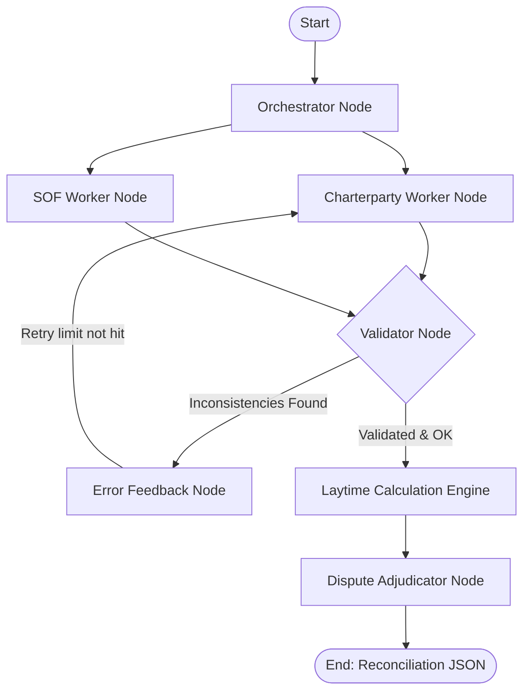

# Keel Multi-Agent Pipeline

[](https://python.org)
[](https://github.com/langchain-ai/langgraph)
[](https://docs.pydantic.dev)
[](https://fastapi.tiangolo.com)
[](#)

---

**Problem:** Processing unstructured, high-stakes maritime shipping documents (Charterparties, Statements of Facts, and Claims) is error-prone when using single-prompt LLM agents. Hallucinations in dates, quantities, and vessel names propagate to laytime engines, leading to costly billing disputes.

**Solution:** A stateful multi-agent system utilizing the **Orchestrator-Worker-Validator** pattern implemented in **LangGraph**. The Orchestrator schedules specialized extraction nodes, while an independent Validator runs cross-document checks (e.g. vessel name alignment, chronologies, coordinates). If validation checks fail, validation errors loop back to the workers with structured feedback for iterative self-correction.

---

## Agent Pipeline Flow



---

## Directory Structure

```text
keel-multi-agent-pipeline/
├── apps/
│   ├── api/
│   │   ├── keel_api/
│   │   │   ├── pipeline_agents.py    # LangGraph multi-agent orchestration graph
│   │   │   ├── pipeline.py           # Unified pipeline execution wrapper
│   │   │   ├── engine/               # Pure-Python deterministic laytime engine
│   │   │   ├── parsing/              # PyMuPDF and pdfplumber parsers
│   │   │   ├── extraction/           # Raw OpenAI extraction layer
│   │   │   ├── rules/                # Codified maritime rules (BIMCO 2013)
│   │   │   └── main.py               # FastAPI web endpoints
│   │   └── tests/                    # Unit and E2E validation test suites
│   └── web/                          # Next.js 15 frontend claim portal
├── fixtures/                         # Cached JSON validation files
└── docker-compose.yml                # Monorepo compose file (Next.js + FastAPI)
```

---

## Quick Start (Zero-Key Dry Run)

To run the pipeline and test cases locally in 5 seconds with **zero API keys** (using high-fidelity cached fixtures), run:

### 1. Start the services
```bash
docker compose up --build
```

- **Frontend Claim Portal:** `http://localhost:3000`
- **FastAPI Agent API:** `http://localhost:8000`

### 2. Verify with local testing
To run the automated E2E tests and verify that the multi-agent graph reconciles the canonical dispute to exactly `$112,000`:
```bash
docker compose exec api pytest
```

---

## Related

- [**ertval.github.io**](https://ertval.github.io) — Portfolio & CV
- [**two-tier-safe-ai-gate**](https://github.com/ertval/two-tier-safe-ai-gate) — Safe AI execution model (Go + Inngest + Omnigent)
- [**keel-multi-agent-pipeline**](https://github.com/ertval/keel-multi-agent-pipeline) — Multi-agent maritime intelligence (Python + LangGraph)
- [**social-network**](https://github.com/ertval/social-network) — Go vertical-slices full-stack monolith (Next.js)
- [**make-your-game**](https://github.com/ertval/make-your-game) — Pure JS ECS game engine
- [**real-time-forum**](https://github.com/ertval/real-time-forum) — Go + Vanilla JS real-time WebSocket SPA
- [**forum**](https://github.com/ertval/forum) — Go hexagonal architecture monolith (zero-dependency)
