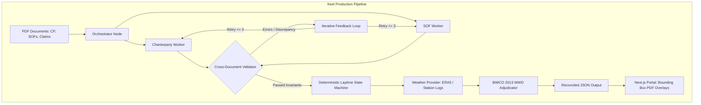
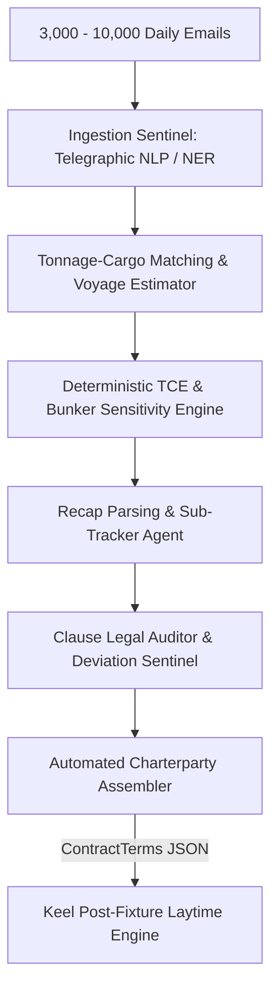
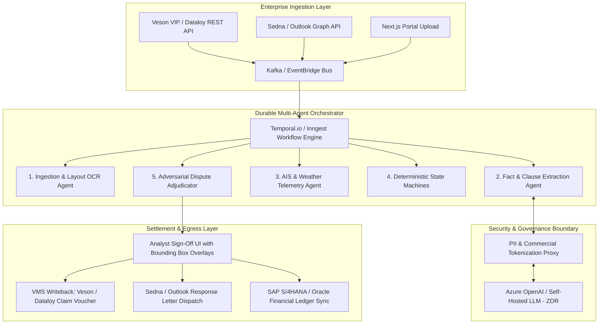

> **Superseded.** Controlling text is [docs/KEEL_UNIFIED_REPORT.md](KEEL_UNIFIED_REPORT.md). This file is retained as a source. Do not cite it where it conflicts with the unified report.

# Keel Strategic Plan: Market Landscape, Defensibility Moats, and Multi-Agent Expansion Blueprint

**Document Version:** 1.0.0  
**Date:** September 30, 2026  
**Status:** Approved for Architectural & Commercial Execution  
**Target Systems:** Keel Multi-Agent Pipeline (`apps/api`), Frontend Claims Portal (`apps/web`)

---

## Table of Contents
1. [Executive Summary & North Star Vision](#1-executive-summary--north-star-vision)
2. [Keel Codebase Architecture & Current Foundations](#2-keel-codebase-architecture--current-foundations)
3. [Market Findings & Competitive Incumbent Benchmarking](#3-market-findings--competitive-incumbent-benchmarking)
4. [Moat & Defensibility Strategic Evaluation](#4-moat--defensibility-strategic-evaluation)
5. [Adjacent Maritime Problem Spaces & Integration Blueprints](#5-adjacent-maritime-problem-spaces--integration-blueprints)
   - [5.1 Post-Fixture Operations: Speed & Cons, Off-Hire, and Bunkers](#51-post-fixture-operations-speed--consumption-off-hire-and-bunkers)
   - [5.2 Port Logistics & Disbursement Account (PDA/FDA) Auditing](#52-port-logistics--disbursement-account-pdafda-auditing)
   - [5.3 Decarbonization, Emissions Compliance & Fuel Management](#53-decarbonization-emissions-compliance--fuel-management)
   - [5.4 Pre-Fixture Commercial Chartering & Upstream Expansion](#54-pre-fixture-commercial-chartering--upstream-expansion)
   - [5.5 Trade Documentation, Electronic Bills of Lading (eBL) & Trade Finance](#55-trade-documentation-electronic-bills-of-lading-ebl--trade-finance)
   - [5.6 Maritime Legal Dispute Resolution, Evidence Bundling & Arbitration](#56-maritime-legal-dispute-resolution-evidence-bundling--arbitration)
6. [Target Enterprise Architecture & Integration Blueprints](#6-target-enterprise-architecture--integration-blueprints)
7. [Phased Strategic Roadmap (Horizons 1 to 4)](#7-phased-strategic-roadmap-horizons-1-to-4)
8. [Immediate Action Items for the Keel Codebase](#8-immediate-action-items-for-the-keel-codebase)
9. [Free Hosting Architecture & Live Demo Deployment Strategy](#9-free-hosting-architecture--live-demo-deployment-strategy)

---

## 1. Executive Summary & North Star Vision

The global commercial maritime shipping industry moves over 11 billion tons of cargo annually, governed by centuries-old legal standards, bilateral contracts (Charterparties), and operational logs (Statements of Facts). Despite the high capital at stake—where a single voyage dispute regularly involves between $50,000 and $500,000 in disputed liquidity—the commercial workflow remains reliant on unstructured emails, manual Excel recalculations, and subjective negotiations.

**Keel** was conceived to solve the core laytime and demurrage reconciliation challenge: replacing error-prone single-prompt LLM extraction with a stateful **Orchestrator-Worker-Validator** multi-agent graph coupled to a **deterministic mathematical state machine**.

### The Strategic Imperative
Our market and competitive analysis reveals a fundamental commercial reality:
> **Document parsing + deterministic laytime calculation provides zero durable defensibility on its own.**

Incumbents such as **Veson Nautical** (with IMOS and Claims CoCaptain) and **Marcura** (with DA-Desk, HubSE, and Shipdem) already own the enterprise systems of record and millions of historical voyage files. Baseline PDF extraction is increasingly commoditized by general multimodal foundation models.

**The North Star Vision for Keel:**  
Keel must evolve from a standalone *"calculator with an OCR/LLM front-end"* into the **Neutral Bilateral Settlement Exchange for Maritime Trade**. By combining:
1. An **adversarial reconciliation engine** that pinpoints exact line-item disputes between opposing claims,
2. An **evidentiary provenance engine** linking every cent to pixel-accurate PDF bounding boxes, certified meteorological hindcasts, and codified BIMCO rules,
3. A **multi-problem expansion** into Port Disbursement Accounts (PDAs/FDAs), Speed & Consumption, Off-Hire, and Decarbonization compliance (EU ETS / FuelEU Maritime), and
4. An **upstream integration** that flows negotiated terms directly from pre-fixture email circulars into post-fixture execution,

Keel will capture the system-of-action layer across commercial maritime operations.

---

## 2. Keel Codebase Architecture & Current Foundations

### 2.1 Current Codebase Inventory
The Keel platform consists of a Python FastAPI backend and a Next.js 15 frontend claim portal:

* **Multi-Agent Orchestration Layer:** [`apps/api/keel_api/pipeline_agents.py`](file:///home/ertval/code/project-modules/keel-multi-agent-pipeline/apps/api/keel_api/pipeline_agents.py)  
  Implements a LangGraph state graph utilizing the Orchestrator-Worker-Validator pattern:
  - `orchestrator_node`: Coordinates ingestion and prepares state.
  - `cp_worker_node`: Extracts Charterparty terms into strict Pydantic schemas (cached fixtures or OpenAI).
  - `sof_worker_node`: Extracts chronological event tables from Owner and Charterer SOFs.
  - `validator_node`: Enforces cross-document invariants (vessel name matching, date monotonicity, rate bounds) and triggers the self-correcting `error_loop_node` upon failure.
  - `laytime_engine_node`: Dispatches validated data to the deterministic engine.
  - `adjudicator_node`: Evaluates disputed line items against external weather ground truth.
* **Deterministic Calculation State Machine:** [`apps/api/keel_api/engine/state_machine.py`](file:///home/ertval/code/project-modules/keel-multi-agent-pipeline/apps/api/keel_api/engine/state_machine.py)  
  A pure-Python state machine calculating laytime allowed, laytime used, turn times, reversible/non-reversible allowances, and enforcing the legal rule *"once on demurrage, always on demurrage"* with zero arithmetic hallucinations.
* **Codified Maritime Rules Library:** [`apps/api/keel_api/rules/evaluators.py`](file:///home/ertval/code/project-modules/keel-multi-agent-pipeline/apps/api/keel_api/rules/evaluators.py)  
  Encapsulates **BIMCO Laytime Definitions 2013** Clause 3.1/3.2 Weather Working Day (WWD) threshold rules (Beaufort Force $\ge 6$, precipitation $\ge 2.0\text{ mm/hr}$, operational prevention check).
* **Data Contracts & Schemas:** [`apps/api/keel_api/schemas.py`](file:///home/ertval/code/project-modules/keel-multi-agent-pipeline/apps/api/keel_api/schemas.py)  
  Pydantic models for `CharterpartyTerms`, `SOFEvent`, `WeatherObservation`, `DisputedLineItem`, and `Reconciliation`.
* **Frontend Claim Portal:** `apps/web/`  
  A Next.js 15 web application delivering the dashboard, document upload flow, side-by-side reconciliation cards, and the interactive PDF viewer ([`apps/web/components/PdfViewer.tsx`](file:///home/ertval/code/project-modules/keel-multi-agent-pipeline/apps/web/components/PdfViewer.tsx)) with bounding box highlight overlays.
* **The Canonical Scenario:**  
  Demonstrated in [`docs/demo_workflow.md`](file:///home/ertval/code/project-modules/keel-multi-agent-pipeline/docs/demo_workflow.md) and [`apps/api/tests/test_canonical.py`](file:///home/ertval/code/project-modules/keel-multi-agent-pipeline/apps/api/tests/test_canonical.py): Reconciles a **$187,000** Owner Claim against a **$62,000** Charterer Calculation across three disputed days (June 14, 15, 16), adjudicating hourly port weather to arrive at the exact legally verified total of **$112,000**.



---

## 3. Market Findings & Competitive Incumbent Benchmarking

The commercial maritime software landscape has entered an aggressive consolidation phase, split into four distinct tiers:

```
┌─────────────────────────────────────────────────────────────────────────────┐
│                       MARITIME SOFTWARE MARKET TIERS                        │
├─────────────────────────┬─────────────────────────┬─────────────────────────┤
│ Tier 1: ERP Monoliths   │ Tier 2: Managed BPO     │ Tier 3: Modern Niche    │
│ (Systems of Record)     │ & Global Networks       │ & Workflow SaaS         │
├─────────────────────────┼─────────────────────────┼─────────────────────────┤
│ • Veson Nautical (VIP)  │ • Marcura Group         │ • Voyager Portal        │
│   - IMOS X              │   - DA-Desk             │   - Demurrage Cockpit   │
│   - Claims CoCaptain    │   - Laytime-Desk        │ • Sedna (Sedna VMS)     │
│   - Shipfix / Q88       │   - Shipdem / HubSE     │ • Windward (D&D AI)     │
│ • Dataloy VMS           │   - PortLog             │ • B&V (SailFast)        │
└─────────────────────────┴─────────────────────────┴─────────────────────────┘
```

### 3.1 Incumbent Deep Dives

#### 1. Veson Nautical (VIP / IMOS Platform, Shipfix, Q88, Oceanbolt)
* **Market Position:** The dominant enterprise ERP across commercial maritime operations. Generates ~$100M+ ARR, managing over 1.1 million voyage claims valued at $71B+ and 4.4 billion metric tons of cargo.
* **Claims CoCaptain (May 2025):** Veson launched native GenAI document extraction directly inside IMOS to extract SOF events from email attachments and compare line items.
* **Vulnerability:** Monolithic architecture, complex desktop UI legacy (`CFG_...` configuration flags), high cost ($50K–$500K/yr + $50K onboarding), and slow feature release cycles. Counterparties resist settling claims inside an opponent's partisan IMOS instance.

#### 2. Marcura Group (DA-Desk, Laytime-Desk / Marcura Claims, PortLog, HubSE, Shipdem)
* **Market Position:** The leader in port disbursement accounting (PDA/FDA) and post-fixture claims. Processes over **200,000 port calls annually** across 350+ enterprise clients, facilitating $15B+ in annual disbursements with a proprietary database of **50M+ SOF events**.
* **Consolidation Moves:** Acquired **HubSE** (February 2025, self-service laytime SaaS) and **Shipdem** (February 2026, specialized tanker/chemical demurrage consultancy) to blend automated software with managed BPO services.
* **Vulnerability:** Heavy reliance on offshore human-in-the-loop (BPO) labor; transactional fee model ($50–$250/call) creates high operational overhead; lack of instant, pixel-level explainable auditability.

#### 3. Sedna (with Dataloy Systems)
* **Market Position:** Sedna acquired European VMS incumbent **Dataloy** in July 2025, rebranding it as **Sedna VMS**. This directly integrates cloud-native voyage calculations into high-velocity email collaboration.
* **Relevance:** Validates Keel’s thesis that maritime calculations must live at the communication and document intake boundary.

#### 4. Voyager Portal
* **Market Position:** Modern cloud SaaS designed for industrial cargo owners, bulk commodity traders, and charterers. Offers a specialized **Demurrage Cockpit** and AI SOF parser to replace spreadsheets.
* **Vulnerability:** Focused primarily on cargo tracking and commercial aggregation; lacks deep legal BIMCO rules evaluation and station-level meteorological provenance.

#### 5. Burmester & Vogel (SailFast)
* **Market Position:** 40-year incumbent in algorithmic laytime calculation. Recently launched SailFast for automated extraction of scanned/handwritten port logs.
* **Vulnerability:** Legacy desktop software footprint; lacks collaborative multi-party dispute portals and external telemetry fusion.

---

### 3.2 Customer Complaints & Industry Whitespace
Interviews, customer reviews, and market surveys across trading houses and shipowners highlight six structural pain points:
1. **Manual Entry Friction:** Despite vendor marketing, operators still spend 3–5 hours per voyage manually re-keying timestamps from scanned PDF SOFs into VMS grids.
2. **The "Excel Negotiation" Vacuum:** Incumbents only calculate what *one party* thinks is owed. The actual $100,000+ dispute is negotiated over weeks of contentious email exchanges with competing spreadsheets attached. **No platform provides a neutral, collaborative side-by-side reconciliation workspace.**
3. **Black-Box Opacity:** Legacy systems display a final number without linking back to contractual clauses or SOF evidence, making claims indefensible in formal negotiations.
4. **Subjective Weather Disputes:** Weather working day (WWD) deductions are the #1 source of arbitration disputes. Port agents routinely log "rain stopped ops" when rain was negligible, or fail to log squalls that prevented mooring. Existing software lacks objective meteorological validation.
5. **Time-Bar Forfeiture:** In tanker charterparties (BPVOY4, Shellvoy 6), owners have strict 60- or 90-day time-bars to present claims with all supporting documents. Processing backlogs cause owners to forfeit hundreds of thousands of dollars annually.

---

## 4. Moat & Defensibility Strategic Evaluation

```
┌─────────────────────────────────────────────────────────────────────────────┐
│                           THE DEFENSIVE STRATEGY                            │
├──────────────────────────────────────┬──────────────────────────────────────┤
│ ❌ COMMODITIZED (NO MOAT)             │ ✅ DEFENSIBLE MOAT (KEEL'S TARGET)    │
├──────────────────────────────────────┼──────────────────────────────────────┤
│ • Ingesting a PDF with GPT-4o        │ • Private corpus of non-standard     │
│ • Parsing tables with pdfplumber     │   rider clauses and concession data  │
│ • Deterministic laytime calculator   │ • "Neutral Switzerland" bilateral    │
│ • Single-party claim export          │   settlement network                 │
│ • Static web dashboard               │ • Station-level meteorological audit │
│                                      │ • Deep email-to-ERP workflow gravity │
│                                      │ • Pre-fixture risk underwriting      │
└──────────────────────────────────────┴──────────────────────────────────────┘
```

### 4.1 The Six Structural Pillars of Keel's Moat

#### Pillar 1: The Private Settlement & Concession Corpus
Charterparties and recaps are confidential, NDA-governed contracts that public LLMs cannot scrape. By processing thousands of voyages, Keel aggregates a proprietary dataset of:
- Bespoke rider clause formulations used by commodity trading desks (Trafigura, Glencore, Vitol, Cargill).
- Counterparty concession win-rates: e.g., *"Counterparty X settles weather disputes at Dampier for an average of 42% on the dollar when confronted with radar rain data."*
- Predictive settlement benchmarks that power automated dispute negotiation.

#### Pillar 2: The "Neutral Switzerland" Exchange Moat
Demurrage is inherently bilateral and adversarial. A charterer will never log in to an owner's Veson IMOS instance, nor will an owner accept numbers from a charterer's internal CTRM. Keel’s positioning as a neutral, trusted intermediary creates an independent network effect where both counterparties inspect identical source-cited facts.

#### Pillar 3: Strict Evidentiary Provenance & P&I Club Endorsement
Arbitration tribunals (LMAA, SMA) reject unverified AI outputs. Keel establishes legal defensibility by:
- Linking every dollar and minute directly to pixel-accurate PDF bounding box coordinates.
- Validating weather against certified station-level anemometers and Copernicus ERA5 reanalysis.
- Codifying BIMCO 2013 Laytime Definitions 15–18.
- Pursuing formal review and endorsement from major International Group P&I Clubs (Gard, Skuld, NorthStandard).

#### Pillar 4: Deep Bi-Directional Workflow Gravity
Keel embeds directly into operational routines:
- **Intake Gravity:** Ingesting inbound claim emails and PDF attachments via Outlook Graph API and Sedna webhooks, automatically logging statutory time-bar deadlines.
- **Financial Gravity:** Exporting digitally countersigned settlement vouchers and writing debit/credit entries directly back into Veson IMOS, Dataloy, and SAP S/4HANA ledgers.

#### Pillar 5: Counterparty Behavior Graph
Institutional memory that maps how specific brokers, charterers, and owners operate—tracking historical claim inflation factors, turnaround times, and preferred dispute resolution tactics.

#### Pillar 6: Moving Upstream (Pre-Fixture Underwriting)
Shifting from post-voyage auditing to pre-fixture underwriting: scoring the demurrage and congestion risk of a planned voyage before the fixture is signed, enabling traders to insert protective clauses and adjust freight bids.

---

## 5. Adjacent Maritime Problem Spaces & Integration Blueprints

To maximize addressable market and enterprise value, Keel's multi-agent architecture will expand into six adjacent problem spaces:

```
                               ┌────────────────────────────────────────────────────────┐
                               │     KEEL UNIFIED MARITIME INTELLIGENCE PLATFORM        │
                               └───────────────────────────┬────────────────────────────┘
                                                           │
        ┌───────────────────┬──────────────────────┬───────┴──────────────┬────────────────────┬────────────────────┐
        ▼                   ▼                      ▼                      ▼                    ▼                    ▼
┌───────────────┐   ┌───────────────┐      ┌───────────────┐      ┌───────────────┐    ┌───────────────┐    ┌───────────────┐
│  Laytime &    │   │ Post-Fixture  │      │ Port Logistics│      │ Decarbon-     │    │  Pre-Fixture  │    │  Trade Docs   │
│  Demurrage    │   │ Claims Hub    │      │  & PDA / FDA  │      │ ization & Fuel│    │  Chartering   │    │  & Compliance │
│ (Core Engine) │   │ (Speed/OffH)  │      │ (Tariff Audit)│      │ (ETS/FuelEU)  │    │ (Recap/Draft) │    │  (eBL / L/C)  │
└───────────────┘   └───────────────┘      └───────────────┘      └───────────────┘    └───────────────┘    └───────────────┘
```

---

### 5.1 Post-Fixture Operations: Speed & Consumption, Off-Hire, and Bunkers

Commercial post-fixture operations suffer from siloed claims management. Demurrage, speed & consumption, off-hire, and bunker claims are often handled in separate spreadsheets, leading to double-dipping or cross-claim contradictions.

#### 1. Speed & Consumption Claims
* **Contractual Framework:** Time charterparties (NYPE 93/2015, Shelltime 4) contain performance warranties: speed in knots (laden/ballast) and fuel consumption in metric tons/day, qualified by "about" (+/- 0.5 knots, +5% consumption under English law, *The Al Bida* [1986]).
* **"Good Weather" Analysis:** Warranties apply only in conditions up to Beaufort Force 4, Douglas Sea State 3 ($H_s \le 1.25\text{ m}$), and no adverse current. Masters routinely over-report weather to evade claims ("logbook padding").
* **Mathematical Engine (*The Didymi* [1988] & *The Gas Enterprise* [1993]):**
  1. *Step 1:* Isolate valid good-weather segments using satellite ocean hindcasts (ECMWF ERA5). Calculate actual vs. warranted speed deficiency factor:
     $$\Delta V = (V_{\text{warr}} - 0.5) - V_{\text{actual}}$$
  2. *Step 2:* Extrapolate the speed deficiency across the entire voyage (including rough weather legs). Compute time lost ($\Delta T$) and fuel overconsumption, applying mutual fuel savings offsets.
* **BIMCO Hull Fouling Clause (2019):** Automatically suspends warranties if the vessel remains idle in tropical waters $>15$ consecutive days at charterer's orders until cleaning occurs.

#### 2. Off-Hire Calculations & Disputes
* **Net Loss of Time (NYPE Cl. 15):** Hire ceases only for time *actually lost to the chartered service*. If machinery breaks down while the vessel is waiting at anchor for an unavailable berth, no time is lost and the vessel remains on-hire (*The Ira* [1995]).
* **Cargo Gear Pro-Rata Deductions:** If 1 of 4 cranes breaks down during discharge:
  $$\text{Off-Hire Time} = \text{Stoppage Duration} \times \left(1 - \frac{\text{Cranes Working}}{\text{Cranes Contracted}}\right)$$
* **Deviations:** Suspend hire from course alteration until the vessel reaches an equidistant position, deducting extra bunkers consumed and port dues incurred.

#### 3. Bunker Quality & Quantity Disputes
* **The "Cappuccino Effect":** Suppliers inject compressed air into delivery lines, aerating fuel to create microbubbles that artificially inflate sounding volumes. Over 24–48 hours, bubbles collapse, resulting in a 20–60 MT shortfall ($15,000–$45,000 loss).
* **Mass Flow Meter (MFM) & ASTM 54B Math:** Direct Coriolis mass measurement (SS 648 standard) or geometric tank wedge calculations for trimmed vessels:
  $$\text{Wedge Volume} = \frac{L \times w \times d^2}{2 \times t}$$
* **ISO 8217 Off-Spec Rule Alarms:** Automated alarms for critical parameters: Cat Fines ($\text{Al+Si} > 60\text{ ppm}$ destroys liners), Flash Point ($< 60^\circ\text{C}$ violates SOLAS and renders vessel unseaworthy), and Sulfur ($> 0.50\%$). Automatically triggers formal Letters of Protest before contractual 7- to 14-day time-bars expire.

#### 4. The Cross-Claim Correlation Engine
Keel’s multi-agent graph cross-validates claims to eliminate billing contradictions:
- *Example:* If an engine breaks down at berth during discharge, the **Off-Hire Agent** informs the **Laytime Engine** to pause laytime, crediting the time to off-hire and preventing duplicate billing.
- *Example:* If a vessel bunkers while awaiting berth at anchor, the engine confirms bunkering occurred on parallel time with zero net loss to the voyage, maintaining the laytime clock.

---

### 5.2 Port Logistics & Disbursement Account (PDA/FDA) Auditing

Port calls generate massive financial leakage: **3% to 15% of all agency invoices contain overcharges, unauthorized markups, or tariff errors**, representing over $5B annually.

#### 1. Master Port Tariff Architecture
Port tariffs are complex, piecewise mathematical functions:
* **Statutory Port Dues:** Billed on Gross Tonnage (GT). Under IMO Res. A.747(18), vessels with Segregated Ballast Tanks are entitled to pay on **Reduced Gross Tonnage (RGT)**:
  $$\text{RGT} = \text{GT} - \text{GT}_{\text{SBT}}$$
  *Omitting this deduction is a frequent source of $2,000–$15,000 overcharges per call.*
* **Environmental Ship Index (ESI):** Tiered 5% to 25% statutory discounts for green vessels.
* **Pilotage & Towage:** Night, weekend, and holiday surcharges (+25% to +100%), cold-move penalties (+50% without engine power), and bollard pull requirements.
* **Berthage:** LOA $\times$ rate per meter per hour, with penal escalation for overstays.

#### 2. Agent Overcharge Vectors
* *FX Spread Skimming:* Converting local currencies (EUR, BRL, ZAR) to USD at inflated internal rates rather than central bank spot fixings.
* *Unjustified Standby:* Charging tug or pilot detention when delays were caused by terminal congestion or weather rather than vessel unreadiness.
* *Duplicate Waste Reception Fees:* Charging private garbage launch fees when mandatory EU Directive 2019/883 "No-Special-Fee" rules already cover waste in standard port dues.

#### 3. Container Demurrage & Detention (D&D) vs. Bulk Laytime
* **Container Shipping:** Per diem equipment and yard storage fees governed strictly by **US FMC 46 CFR Part 541 (OSRA 2022)**.
* **Statutory Penalty:** Under 46 CFR § 541.5, **if an invoice fails to include any mandatory data element (ERD, availability date, free-time schedule, dispute contact), the billed party is legally exempted from the obligation to pay.**
* **Virtual Arrival & JIT:** Codified in the **BIMCO Virtual Arrival Clause**: vessels decelerate to match berth availability, tendering "Virtual NOR" at the calculated original arrival time. Fuel savings are measured and split 50/50 between Owner and Charterer.

---

### 5.3 Decarbonization, Emissions Compliance & Fuel Management

Environmental regulations have converted emissions from retrospective reporting into active financial liabilities:

```
┌─────────────────────────────────────────────────────────────────────────────┐
│                    THE THREE CONCURRENT REGULATORY REGIMES                  │
├──────────────────────┬───────────────────────────────┬──────────────────────┤
│ EU ETS               │ FuelEU Maritime               │ IMO CII              │
│ (Directive 2023/959) │ (Regulation 2023/1805)        │ (MARPOL Annex VI)    │
├──────────────────────┼───────────────────────────────┼──────────────────────┤
│ • Tank-to-Wake       │ • Well-to-Wake lifecycle      │ • Operational Annual │
│   emissions          │   GHG intensity cap           │   Efficiency Ratio   │
│ • Phase-in: 40% (24),│ • Penalty: €2,400 per ton     │ • Rating: A through E│
│   70% (25), 100% (26)│   VLSFO equivalent deficit    │ • Commercial         │
│ • Surrender EUAs     │ • Banking, borrowing, and     │   downgrades for     │
│   annually by Sep 30 │   fleet pooling mechanisms    │   D- and E-rated ships│
└──────────────────────┴───────────────────────────────┴──────────────────────┘
```

#### 1. EU ETS Pass-Through Engine (BIMCO ETSA Clause 2022)
* **Mechanics:** Time charterers must provide EUAs corresponding to fuel consumed during the charter.
* **Dispute Vectors:** Charterers are **not liable** for emissions during off-hire or excess emissions caused by owner breach of speed/consumption warranties (*The Ocean Virgo* [2015]).
* **Keel Integration:** Automatically segregates baseline warranted emissions from excess emissions (hull fouling) and off-hire emissions, calculating the net monthly EUA transfer schedule.

#### 2. FuelEU Maritime Compliance Engine (Effective Jan 1, 2025)
* **GHG Intensity Limit:** Requires a 2% Well-to-Wake reduction in 2025 ($\le 89.34\text{ gCO}_2\text{eq/MJ}$), scaling to 80% by 2050. Standard VLSFO ($\sim 94\text{ g/MJ}$) incurs an immediate compliance deficit.
* **Compliance Balance ($CB$) & Penalty:**
  $$\text{Penalty (EUR)} = \frac{|CB|}{GHGIE_{\text{actual}} \times 41,000} \times 2,400$$
* **Flexibility Optimization:** Simulates banking, advance borrowing (with 10% interest penalty), and fleet pooling options across multi-vessel portfolios.

#### 3. IMO CII Auditing
* **The Port Congestion Paradox:** Distance sailed is in the denominator. When a ship waits at anchor outside a congested port for 3 weeks, it burns fuel while distance is 0 nm, destroying its CII rating.
* **BIMCO CII Clause Disputes:** Evaluates whether an owner’s unilateral decision to slow-steam was contractually justified under subclause (g) or constituted an unlawful breach of dispatch.

#### 4. Automated Noon Report Auditing
Crew often manipulate noon reports ("pencil sharpening") to show bad weather and mask engine overconsumption. Keel cross-references noon report timestamps and GPS coordinates against **Copernicus ECMWF ERA5** and **NOAA WaveWatch III** hindcasts, automatically refuting falsified weather claims.

---

### 5.4 Pre-Fixture Commercial Chartering & Upstream Expansion

Commercial chartering desks process **3,000 to 10,000+ unstructured emails per day** containing open tonnage lists, cargo orders, and fixture recaps in dense telegraphic shorthand.



#### 1. Ingestion Sentinel (Telegraphic NLP)
Ingests the email stream via Microsoft Graph / Sedna webhooks; disambiguates vessel particulars against the IMO Equasis registry and standardizes ports to UN/LOCODE.

#### 2. Tonnage & Cargo Matching + Voyage Estimation
* Formulated as a constrained bipartite matching problem satisfying draft, LOA, vetting (RightShip, SIRE 2.0), and laycan dates.
* **Deterministic Calculations:** Computes distance via sea route graphs, canal tolls (Suez SCNT, Panama PCUMS), and dynamic Time Charter Equivalent (TCE):
  $$\text{TCE (\$/day)} = \frac{\text{Net Freight} - \text{Voyage Costs}}{\text{Total Voyage Days}}$$
* Evaluates non-linear cubic fuel consumption curves ($F(v) \propto v^3$) to optimize speed regimes (eco vs. full speed).

#### 3. Fixture Recap Parsing & Sub-Tracker
Under English law (*The Junior K* [1988]), the Fixture Recap is the legally binding contract once subjects are lifted. Tracks expiring "subs" (Sub Stem, Sub Board, Sub Details) with automated alerts to prevent deals from lapsing.

#### 4. Clause Legal Auditor & Deviation Sentinel
Compares counterparty rider clauses against gold-standard baselines (BIMCO 2020 Sanctions, BIMCO CII 2022, VOYWAR 2013). Flags toxic time-bars (e.g., 30-day notice bars vs. standard 90 days) and generated counter-redlines.

#### 5. Upstream-to-Downstream Bridge
The approved contract outputs structured `ContractTerms` JSON that directly initializes Keel’s downstream [`LaytimeEngine`](file:///home/ertval/code/project-modules/keel-multi-agent-pipeline/apps/api/keel_api/engine/state_machine.py), eliminating manual document uploads entirely.

---

### 5.5 Trade Documentation, Electronic Bills of Lading (eBL) & Trade Finance

* **The eBL Transition:** Accelerated by the **UK Electronic Trade Documents Act 2023 (ETDA 2023)** and the **FIT Alliance** (BIMCO, DCSA, FIATA, ICC, SWIFT). Leading platforms (Wave BL, CargoX, ICE Digital Trade) are achieving interoperability via the **DCSA PINT API** and **Control Tracking Registry (CTR)**.
* **UCP 600 Letter of Credit Discrepancy Checking:**
  - Banks have 5 banking days to examine documents under UCP 600 Art. 14.
  - Multi-agent triangulation cross-verifies B/L, Commercial Invoice, Certificate of Origin, and SGS/Intertek inspection reports against the SWIFT MT700/701 LC:
    * On-board shipment date vs. latest shipment date (Field 44C).
    * Tolerance allowances ($\pm 5\%$ or $\pm 10\%$ under Art. 30).
    * Clean transport document check (Art. 27): verifying the B/L contains no notations of defective condition.
    * Strict preclusion penalty (Art. 16(f)): failure to issue a complete notice of refusal within 5 days forfeits the bank's right to reject documents.
* **Sanctions & Dark Fleet Surveillance:** Ingests satellite AIS, Synthetic Aperture Radar (SAR) detections (piercing clouds to find unbroadcasting vessels), and GNSS spoofing patterns to flag dark fleet rendezvous, STS transfers, and G7 crude price-cap violations prior to cargo discharge.

---

### 5.6 Maritime Legal Dispute Resolution, Evidence Bundling & Arbitration

Over 85% of shipping disputes are resolved through binding arbitration:
* **LMAA (London):** Captures >75% of global maritime arbitrations, governed by English law and the **Arbitration Act 2025** (providing statutory summary disposal powers). Tiered procedures: Small Claims ($\le \$100\text{K}$), Intermediate Claims ($\$100\text{K}–\$400\text{K}$), and Full LMAA Terms. Awards are confidential; loser pays costs.
* **SMA (New York):** Public awards, commercial panels, governed by the US FAA.
* **SCMA (Singapore):** Unadministered model popular across Asian bulk routes.

#### 1. Contract Precedence & Legal Doctrine
* *Typed Riders Supersede Printed Proformas:* Confirmed under English law (*The Starsin* [2003]).
* *NOR Validity & Waiver:* Premature NOR is invalid (*The Mexico I* [1990]), but commencement of discharge without protest waives invalidity (*The Happy Day* [2002]).

#### 2. Automated Legal Evidence Bundling
Keel auto-compiles paginated, OCR-indexed PDF/A evidence bundles conforming to English Commercial Court Guide standards:
- Chronological alignment of Master/Agent SOFs, engine logs, and email correspondence normalized to UTC.
- Cross-referencing deck logs with ERA5 radar precipitation data to adjudicate weather veracity.
- Automated segregation of "Without Prejudice" settlement correspondence and privileged legal advice.

#### 3. Settlement Optimization (Game Theory)
Calculates Expected Monetary Value (EMV) and determines mathematically optimal **Calderbank Offers** (Without Prejudice Save as to Costs) to exert maximum cost-shifting pressure on the counterparty under English cost rules.

---

## 6. Target Enterprise Architecture & Integration Blueprints

To scale across conservative Tier-1 shipowners (e.g., Greek shipping clusters) and global commodity trading houses (Trafigura, Glencore, Cargill, Vitol), Keel must meet rigorous enterprise security and integration standards.



### 6.1 Enterprise Integration Standards
1. **Core VMS Connectors:**
   - **Veson VIP (`api.veslink.com` / `platform.veson.com`):** Ingests port call itineraries and outputs finalized demurrage vouchers.
   - **Dataloy VMS (`[instance].dataloy.com/ws/rest`):** Queries cargo parcels and syncs timesheet line-item deductions.
   - **Sedna Webhooks:** Listens for `message.created` on voyage threads, downloads PDF claims, and posts dispute response letters.
2. **Durable Workflow Orchestration (Temporal.io / Inngest):**
   - Demurrage disputes span weeks. Replacing in-memory graphs with durable workflows ensures state persistence, retries, and asynchronous human-in-the-loop (HITL) approvals without state loss.
3. **Telemetry & Ground-Truth Ingestion:**
   - Satellite AIS (Spire / Kpler) to verify "Arrived Ship" status at anchorage and berth.
   - Copernicus ERA5 / DTN / StormGeo for hourly hindcast weather logs.

### 6.2 Enterprise Security & Threat Model
* **Commodity Trading House Threat Model:** Fixture rates, cargo volumes, and voyage delays represent material non-public market information. Leaks can allow competitors to front-run physical deliveries or commodity futures.
* **Security Controls:**
  - **Zero Data Retention (ZDR):** Contractual enterprise agreements ensuring prompts and completions are never stored on disk or used for model training.
  - **Commercial Tokenization Proxy:** Pre-processing gateway that redacts vessel names, counterparty identities, and freight rates before dispatching prompts to LLMs, de-tokenizing responses locally in-memory.
  - **Single-Tenant VPC & BYOK:** Dedicated AWS/Azure VPC deployments with Customer-Managed Encryption Keys (AWS KMS / Azure Key Vault).
  - **SOC 2 Type II Certification:** Audited across all 5 Trust Services Criteria (with particular emphasis on Processing Integrity).

---

## 7. Phased Strategic Roadmap (Horizons 1 to 4)

```
┌─────────────────────────────────────────────────────────────────────────────┐
│                          FOUR-HORIZON EXECUTION ROADMAP                     │
├──────────────────────────┬──────────────────────────┬───────────────────────┤
│ Horizon                  │ Focus & Core Deliverables│ Milestones / Metrics  │
├──────────────────────────┼──────────────────────────┼───────────────────────┤
│ HORIZON 1 (Months 0–6)   │ • Asymmetric Defense     │ • 50 beta voyages     │
│ Asymmetric Defense Wedge │   Wedge for Charterers   │ • Zero-key offline run│
│                          │ • Outlook/Sedna auto-    │ • $50K+ average claim │
│                          │   ingestion              │   savings verified    │
│                          │ • Click-to-source bbox   │                       │
├──────────────────────────┼──────────────────────────┼───────────────────────┤
│ HORIZON 2 (Months 6–12)  │ • Port DA (FDA/PDA)      │ • 10 port tariffs     │
│ Post-Fixture Expansion   │   tariff audit module    │   codified            │
│                          │ • Speed & Cons (Didymi)  │ • Veson/Dataloy read  │
│                          │ • Bunker cappuccino math │   connectors live     │
├──────────────────────────┼──────────────────────────┼───────────────────────┤
│ HORIZON 3 (Months 12–24) │ • EU ETS & FuelEU        │ • Temporal engine     │
│ Decarbonization & VMS    │   regulatory engine      │ • SOC 2 Type II audit │
│ Writeback Hub            │ • Bi-directional VMS     │ • P&I Club technical  │
│                          │   claim writeback        │   endorsement memo    │
├──────────────────────────┼──────────────────────────┼───────────────────────┤
│ HORIZON 4 (Months 24–36) │ • Neutral Switzerland    │ • Network liquidity   │
│ Bilateral Exchange &     │   bilateral settlement   │ • Multi-party eBL     │
│ Pre-Fixture Underwriting │ • Pre-fixture risk score │   reconciliation      │
│                          │ • eBL / LC discrepancy   │ • Automated LMAA file │
└──────────────────────────┴──────────────────────────┴───────────────────────┘
```

### Horizon 1: The Asymmetric Defense Wedge (Months 0–6)
* **Strategy:** Target charterers and commodity trading desks who are on defense—receiving inflated $150K–$500K demurrage claims from owners, understaffed to audit them.
* **Deliverables:**
  - Complete the LangGraph Orchestrator-Worker-Validator loop in [`pipeline_agents.py`](file:///home/ertval/code/project-modules/keel-multi-agent-pipeline/apps/api/keel_api/pipeline_agents.py).
  - Implement full BIMCO 2013 Definitions 15 and 16 weather evaluation in [`evaluators.py`](file:///home/ertval/code/project-modules/keel-multi-agent-pipeline/apps/api/keel_api/rules/evaluators.py).
  - Polish the Next.js side-by-side reconciliation interface with clickable bounding box overlays.
  - Deliver Outlook / Sedna email auto-ingestion for inbound claims and time-bar tracking.

### Horizon 2: Post-Fixture Expansion & Port DA Auditing (Months 6–12)
* **Strategy:** Expand into high-volume recurring port expenses and time-charter claims.
* **Deliverables:**
  - Launch Port Disbursement Account (PDA/FDA) auditing module against master port tariffs (verifying SBT deductions, pilotage tariffs, and FX markups).
  - Integrate Speed & Consumption warranty evaluation using *The Didymi* two-step extrapolation and Copernicus ERA5 ocean hindcasts.
  - Implement Bunker Quantity (cappuccino effect / wedge math) and ISO 8217 quality alarms.

### Horizon 3: Decarbonization & VMS Writeback Hub (Months 12–24)
* **Strategy:** Establish enterprise integration and capitalize on EU environmental mandates.
* **Deliverables:**
  - Implement EU ETS pass-through allowance calculations and FuelEU Maritime penalty/pooling optimizers.
  - Transition core orchestration to **Temporal.io** for durable multi-week dispute tracking.
  - Deploy bi-directional REST writeback connectors for Veson IMOS and Dataloy/Sedna VMS.
  - Complete SOC 2 Type II audit and deploy commercial tokenization proxies.

### Horizon 4: The Neutral Bilateral Settlement Exchange (Months 24–36)
* **Strategy:** Scale into the industry standard for multi-party commercial execution.
* **Deliverables:**
  - Launch collaborative dispute resolution workspaces with digital counter-signing and settlement release agreements.
  - Shift left into Pre-Fixture Demurrage Underwriting: scoring voyage congestion risks and recommending protective rider clauses during fixture negotiations.
  - Integrate eBL (DCSA PINT) and UCP 600 Letter of Credit discrepancy checking for trade finance institutions.

---

## 8. Immediate Action Items for the Keel Codebase

To advance Keel toward this strategic roadmap, the following technical tasks are scheduled for implementation:

```
┌─────────────────────────────────────────────────────────────────────────────┐
│                       IMMEDIATE TECHNICAL WORKSTREAM                        │
├──────────────┬───────────────────────────────┬──────────────────────────────┤
│ Component    │ File / Module                 │ Implementation Target        │
├──────────────┼───────────────────────────────┼──────────────────────────────┤
│ Pipeline     │ apps/api/keel_api/            │ Wire LangGraph agents into   │
│ Entrypoint   │ pipeline.py                   │ run_voyage_pipeline()        │
├──────────────┼───────────────────────────────┼──────────────────────────────┤
│ Rules Engine │ apps/api/keel_api/rules/      │ Complete BIMCO 2013 Def 15   │
│              │ evaluators.py                 │ (pro-rata working hours)     │
├──────────────┼───────────────────────────────┼──────────────────────────────┤
│ Weather      │ apps/api/keel_api/weather/    │ Add live Open-Meteo / ERA5   │
│ Provider     │ openmeteo_provider.py         │ client with fallback caching │
├──────────────┼───────────────────────────────┼──────────────────────────────┤
│ Data Schema  │ apps/api/keel_api/schemas.py  │ Add PortCall, DAExpenseItem, │
│              │                               │ and PerformanceWarranty      │
├──────────────┼───────────────────────────────┼──────────────────────────────┤
│ Frontend     │ apps/web/app/voyage/[id]/     │ Enhance interactive dispute  │
│ Portal       │ reconcile/page.tsx            │ cards with letter exporter   │
└──────────────┴───────────────────────────────┴──────────────────────────────┘
```

1. **Unify Pipeline Orchestrator:** Replace the mock fallback in [`apps/api/keel_api/pipeline.py`](file:///home/ertval/code/project-modules/keel-multi-agent-pipeline/apps/api/keel_api/pipeline.py) with the LangGraph runner from [`pipeline_agents.py`](file:///home/ertval/code/project-modules/keel-multi-agent-pipeline/apps/api/keel_api/pipeline_agents.py), ensuring end-to-end tests pass cleanly.
2. **Expand BIMCO Rules Coverage:** Upgrade [`evaluators.py`](file:///home/ertval/code/project-modules/keel-multi-agent-pipeline/apps/api/keel_api/rules/evaluators.py) to support both Definition 15 (proportional day) and Definition 16 (24 consecutive hours) formulations.
3. **Live Weather Client:** Implement an Open-Meteo / Copernicus ERA5 client in `apps/api/keel_api/weather/` alongside the existing [`FixtureWeatherProvider`](file:///home/ertval/code/project-modules/keel-multi-agent-pipeline/apps/api/keel_api/weather/fixture_provider.py).
4. **Draft Port DA Models:** Extend [`schemas.py`](file:///home/ertval/code/project-modules/keel-multi-agent-pipeline/apps/api/keel_api/schemas.py) with initial models for Port Disbursement Account line items and tariff discrepancies to prepare for Horizon 2.


---

## 9. Free Hosting Architecture & Live Demo Deployment Strategy

Deploying Keel for external evaluation, hackathon judging, or commercial demos requires navigating specific technical constraints inherent to the stack:
- **Frontend:** Next.js 15/16 App Router, React 19, Tailwind CSS v4, `react-pdf` (requiring Turbopack canvas stubs), and dynamic routes (`/voyage/[id]`, `/voyage/[id]/reconcile`, `/voyage/[id]/letter`).
- **Backend:** Python 3.11+, FastAPI, Uvicorn, LangGraph multi-agent state graph, PyMuPDF (C++ MuPDF bindings), `pdfplumber` (pdfminer.six, pypdfium2), and SQLite (`keel.db`).
- **The Memory Cliff (300MB – 480MB RAM):** Parsing dense multi-page tabular Statements of Facts (SOFs) causes memory spikes to 300–480MB. Standard free cloud tiers capped at **512MB RAM (Render & Koyeb)** risk sporadic **Out-of-Memory (OOM) kills (Exit code 137)** if files are processed concurrently.
- **The 4.5 MB Payload Limit on Vercel:** Vercel serverless functions enforce a strict 4.5 MB request body limit. Because maritime charterparty and claim PDFs regularly exceed 5–20 MB, document upload `FormData` must post directly to the FastAPI backend (`NEXT_PUBLIC_API_URL`), bypassing Vercel serverless proxies.

### 9.1 Platform Benchmark Matrix

| Dimension | 🥇 Option 1: Local Host + Cloudflare Tunnel | 🥈 Option 2: Vercel + Hugging Face Spaces | 🥉 Option 3: Unified Render Monolith |
| :--- | :--- | :--- | :--- |
| **Best Used For** | **Live Demos, Pitches & Judge Reviews** | **Permanent 24/7 Public Cloud URL** | Single-repo fallback cloud |
| **Cost / Credit Card** | **$0 (Zero Card / Zero Auth)** | **$0 (Zero Card)** | $0 (Zero Card) |
| **Frontend Platform** | Localhost (:3000) via Cloudflare Edge | Vercel (Edge CDN) | Render Web Service (Port 8080) |
| **Backend Platform** | Localhost (:8000) via Cloudflare Edge | Hugging Face Spaces (Port 7860) | Render Web Service (Internal) |
| **Backend RAM** | **Host RAM (16 GB – 64 GB+)** | **16 GB RAM (Dedicated Free)** | ⚠️ 512 MB RAM (Hard Limit) |
| **Cold Start Latency** | **0 ms (Instant, warm daemon)** | ~15s (wake on HTTP hit) | ⚠️ 50s – 75s (after 15m idle) |
| **PDF Parsing OOM Risk** | **Zero (Infinite host memory)** | **Zero (16 GB allocation)** | High (>350MB spikes trigger OOM 137) |
| **Upload Payload Limit** | Unlimited (Host disk) | Unlimited (Direct to HF Space) | Unlimited (Direct to container) |
| **Data Persistence** | 100% Persistent on local disk | Ephemeral (Auto-seeds `voyage_001`) | Ephemeral (Auto-seeds `voyage_001`) |

---

### 9.2 Option 1: Full Local Host + Cloudflare Tunnel (Recommended for Live Demos)

**Why this is the premier option for presentations:**
- **Zero Cold Starts:** Your local machine is already warm; pages and calculations respond in milliseconds.
- **Zero Memory Constraints:** Heavy PDF extraction and multi-agent validation loops run with full CPU/RAM capacity.
- **Instant HTTPS & Anycast Edge:** Cloudflare terminates SSL at the edge and routes traffic through an encrypted tunnel directly into your local ports without port-forwarding or firewall changes.

#### Quick Tunnel (Zero Setup - 30 Seconds):
```bash
# 1. Install cloudflared (Debian/Ubuntu)
curl -L --output cloudflared.deb https://github.com/cloudflare/cloudflared/releases/latest/download/cloudflared-linux-amd64.deb
sudo dpkg -i cloudflared.deb

# 2. Start the local backend and frontend
# Terminal 1 (Backend API):
cd apps/api && source .venv/bin/activate && uvicorn keel_api.main:app --port 8000

# Terminal 2 (Next.js Frontend):
cd apps/web && pnpm dev --port 3000

# 3. Launch the public HTTPS tunnel pointing to the frontend
cloudflared tunnel --url http://localhost:3000
```
`cloudflared` prints an instant public URL: `https://random-words.trycloudflare.com`.

#### Named Tunnel with Ingress Rules (Permanent Custom Domain):
Create a configuration file at `~/.cloudflared/config.yml` that routes both frontend and backend through a single custom domain, completely eliminating CORS:
```yaml
tunnel: <TUNNEL_ID>
credentials-file: /home/ertval/.cloudflared/<TUNNEL_ID>.json

ingress:
  # Route API endpoints directly to FastAPI
  - hostname: keel.yourdomain.com
    path: ^/(voyages|healthz|static|letter)
    service: http://localhost:8000

  # Route all other web traffic to Next.js
  - hostname: keel.yourdomain.com
    service: http://localhost:3000

  - service: http_status:404
```

---

### 9.3 Option 2: Decoupled Cloud Free-Tier (Vercel Frontend + Hugging Face Spaces Backend)

**Why this is the premier option for an always-on 24/7 cloud link:**
- **Frontend (Vercel):** Native Next.js 15 support, global edge CDN, 100 GB/month bandwidth.
- **Backend (Hugging Face Spaces):** Provides **16 GB RAM and 2 vCPUs on `cpu-basic` for FREE**, completely resolving the 512MB RAM ceiling that breaks Render and Koyeb.

#### Step 1: Deploy Backend to Hugging Face Spaces
Create a new Space at [huggingface.co/new-space](https://huggingface.co/new-space) with the **Docker SDK** and hardware **Free (CPU Basic - 2 vCPU, 16GB RAM)**. Use the following `Dockerfile`:

```dockerfile
FROM python:3.11-slim

RUN apt-get update && apt-get install -y --no-install-recommends \
    build-essential curl && rm -rf /var/lib/apt/lists/*

# Hugging Face runs under UID 1000
RUN useradd -m -u 1000 user
USER user
ENV HOME=/home/user PATH=/home/user/.local/bin:$PATH PORT=7860

WORKDIR $HOME/app

COPY --chown=user:user apps/api/pyproject.toml ./
RUN pip install --no-cache-dir --upgrade pip && pip install --no-cache-dir .

COPY --chown=user:user apps/api/keel_api ./keel_api
COPY --chown=user:user fixtures ./fixtures

EXPOSE 7860
CMD ["uvicorn", "keel_api.main:app", "--host", "0.0.0.0", "--port", "7860"]
```
*Backend URL:* `https://<username>-<spacename>.hf.space`

#### Step 2: Deploy Frontend to Vercel
1. In [Vercel](https://vercel.com), import the repository and set **Root Directory** to `apps/web`.
2. Configure **Environment Variables**:
   * `NEXT_PUBLIC_API_URL`: `https://<username>-<spacename>.hf.space`
   * `FASTAPI_BACKEND_URL`: `https://<username>-<spacename>.hf.space`
3. Configure `apps/web/next.config.ts` to proxy PDF citations:
```typescript
import path from "path";
import type { NextConfig } from "next";

const FASTAPI_URL = process.env.FASTAPI_BACKEND_URL || "http://localhost:8000";

const nextConfig: NextConfig = {
  turbopack: {
    root: path.resolve(__dirname),
    resolveAlias: { canvas: "./empty-module.ts" },
  },
  env: {
    NEXT_PUBLIC_API_URL: process.env.NEXT_PUBLIC_API_URL ?? "http://localhost:8000",
  },
  async rewrites() {
    return [
      {
        source: "/static/:path*",
        destination: `${FASTAPI_URL}/static/:path*`,
      },
    ];
  },
};

export default nextConfig;
```

---

### 9.4 Option 3: Unified Single-Container Cloud Monolith (Render Free)

To deploy both frontend and backend within Render's single free web service limit (750 hours/month):

Package Next.js (Standalone output) and FastAPI into a single multi-stage Docker container fronted by **Caddy**:
- Public traffic enters on `$PORT` assigned by Render.
- Caddy routes `/voyages*`, `/healthz*`, `/static*` internally to FastAPI on port `8000`.
- Caddy routes all UI traffic to Next.js on port `3000`.
- Single container = 720 hours/month = **100% free 24/7 without exceeding workspace quota**.

*Memory Optimization for 512MB RAM:* Run Uvicorn with a single worker (`--workers 1`) and ensure PDF parsing tasks run sequentially rather than concurrently.

---

### 9.5 Free-Tier Keep-Alive & UX Optimization Tactics

#### Automated GitHub Actions Keep-Alive Heartbeat (`.github/workflows/keep-alive.yml`)
Prevents cloud instances from sleeping during evaluation periods by sending a free ping every 10 minutes:
```yaml
name: Free Tier Keep-Alive Heartbeat

on:
  schedule:
    - cron: '*/10 * * * *'
  workflow_dispatch:

jobs:
  ping:
    runs-on: ubuntu-latest
    steps:
      - name: Ping Backend Healthz
        run: |
          STATUS=$(curl -s -o /dev/null -w "%{http_code}" https://<YOUR_BACKEND_URL>/healthz)
          echo "Health check returned status $STATUS"
```

#### Next.js Cold-Start Graceful Fallback (`apps/web/hooks/useBackendWakeUp.ts`)
Displays an informative loading status ("Waking up demo server...") instead of throwing network errors when waking up a sleeping backend:
```typescript
import { useEffect, useState } from "react";

export function useBackendHealth(apiBaseUrl: string) {
  const [isWakingUp, setIsWakingUp] = useState(false);
  const [isReady, setIsReady] = useState(false);

  useEffect(() => {
    let timeout: NodeJS.Timeout;
    const check = async () => {
      try {
        const res = await fetch(`${apiBaseUrl}/healthz`, { method: "GET", cache: "no-store" });
        if (res.ok) {
          setIsReady(true);
          setIsWakingUp(false);
          return;
        }
      } catch (err) {
        setIsWakingUp(true);
      }
      timeout = setTimeout(check, 3000);
    };
    check();
    return () => clearTimeout(timeout);
  }, [apiBaseUrl]);

  return { isWakingUp, isReady };
}
```

---
*End of Strategic Plan & Free Hosting Architecture Blueprint. Approved for execution.*

