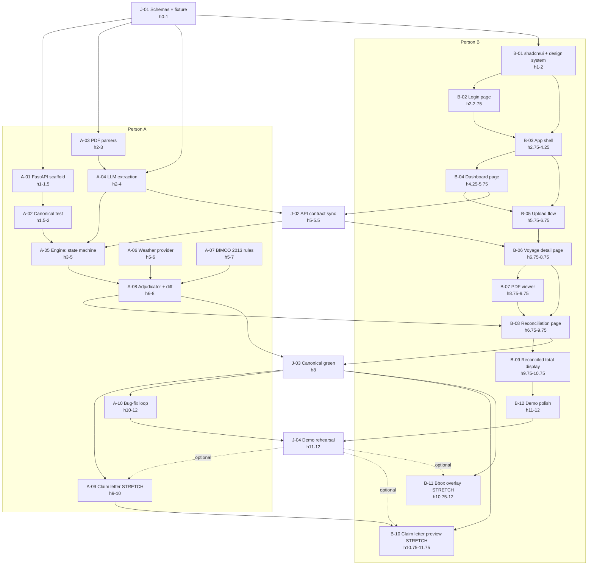

# Keel — Ticket Tracker

12-hour hackathon build for a 2-person team. Tickets are organized into three streams:

- **Magnus** — backend, engine, rule library (Person A)
- **Ertval** — frontend, demo UX (Person B)
- **Joint** (below) — synchronous checkpoints both people stop for

The single success criterion: **at hour 8, the canonical scenario in [PRD Section 4](../prd.md) produces `reconciled_total_usd == 112_000` end-to-end through the UI.** Everything else is in service of that.

---

## Joint tickets

These are the only times both people stop their work and align. Skipping these is the fastest way to ship a broken demo.

### J-01 — Pre-flight: schemas + fixture (hour 0 → 1)

**Owner**: Both, pair-programming.
**Blocks**: every Person A ticket from A-01 onward; every Person B ticket from B-01 onward.

- Write the final Pydantic schemas from [PRD §9](../prd.md) into `apps/api/keel_api/schemas.py`. Both parties must agree these are frozen.
- Generate or hand-tune the canonical voyage_001 fixture (5 PDFs + `weather_port_xyz.json`) so the engine will produce `$187,000 / $62,000 / $112,000` exactly. Synthesize PDFs from Markdown if no real samples are available.
- Commit `fixtures/voyage_001/expected_reconciliation.json` — the ground-truth oracle the canonical assertion test (A-02) checks against.

**Done when**: schemas are committed, all six fixture files exist on disk, the expected reconciliation JSON declares `$112,000` and the three per-day verdicts.

---

### J-02 — API contract checkpoint (hour 5 → 5.5)

**Owner**: Both, 30-minute sync.
**Blocked by**: A-04 (LLM extraction), B-04 (dashboard/upload).
**Blocks**: A-05 (calculation engine), B-06 (voyage detail page).

- Person B stops using the mock API and points the frontend at Person A's `/extract` and `/calculate` endpoints.
- Resolve the inevitable schema drift. **Pydantic shapes win** — frontend adapts.
- Confirm both `$187,000` and `$62,000` render in the UI (reconciliation not yet wired).

**Done when**: voyage detail page renders real numbers for both parties from a real backend.

---

### J-03 — Canonical assertion green (hour 8)

**Owner**: Person A presents, Person B verifies in UI.
**Blocked by**: A-08, B-08.
**Blocks**: A-09, A-10, B-09, B-10, B-11.

- Run `pytest -k canonical` — must pass.
- Open the reconciliation page in the browser. Must show `$112,000` with three day cards (June 14 = owner, June 15 = owner, June 16 = charterer).
- If this is not green at hour 8, stop adding features. Both people drop into fix-mode.

**Done when**: `$112,000` is rendered in the browser via the real pipeline.

---

### J-04 — Demo rehearsal (hour 11 → 12)

**Owner**: Both.
**Blocked by**: A-10, B-12.

- Run the [PRD §12 demo script](../prd.md) verbatim, twice, with a stopwatch.
- Identify and fix only the things that break the script. **Stop fixing anything else.**
- Confirm: laptop charged, browser zoom set, tabs pre-opened, fixtures pre-uploaded if needed.

**Done when**: two clean run-throughs under 100 seconds each.

---

## Dependency graph



---

## Timeline (Gantt-style)

```
Hour:    0    1    2    3    4    5    6    7    8    9   10   11   12
         |----|----|----|----|----|----|----|----|----|----|----|----|
JOINT    [J01]                   [J02]            [J03]            [J04]
PERSON A      [A01][A02][A03 ][A04   ][A05  ][A07  ][A08  ][A09 ][A10  ]
                                     [A06]
PERSON B      [B01     ][B02 ][B03      ][B04 ][B05  ][B06       ][B12 ]
                                                [B08            ]
                                                     [B07 ][B09 ][B10/11*]

* = stretch goals, only if everything else is green
```

---

## Operating rules

1. **No work that isn't tracked here.** If you discover a new task, write a ticket before you start.
2. **The canonical assertion is the only metric.** A passing `$112,000` test beats any other progress.
3. **Stretch goals are stretch.** A-09, B-10, B-11 only after J-03 is green.
4. **Hour-10 hard freeze on new UI work.** From hour 10, frontend is bug-fix only.
5. **Push to `main` every successful ticket.** Visible progress prevents both people drifting.

---

## Stretch goals (only after J-03)

| Ticket | Owner | Why deferred |
|---|---|---|
| A-09 — Claim letter PDF generation | A | Plain HTML preview is enough for the demo |
| B-10 — Claim letter preview | B | Same as above |
| B-11 — Bbox overlay on PDF | B | react-pdf overlays often take 4-6h; cost too high for demo value |
| Reversible laytime in engine | A | Out of v1 engine scope per PRD §10 |
| Real weather API (Open-Meteo) | A | Fixture provider is fully sufficient for v1 |
