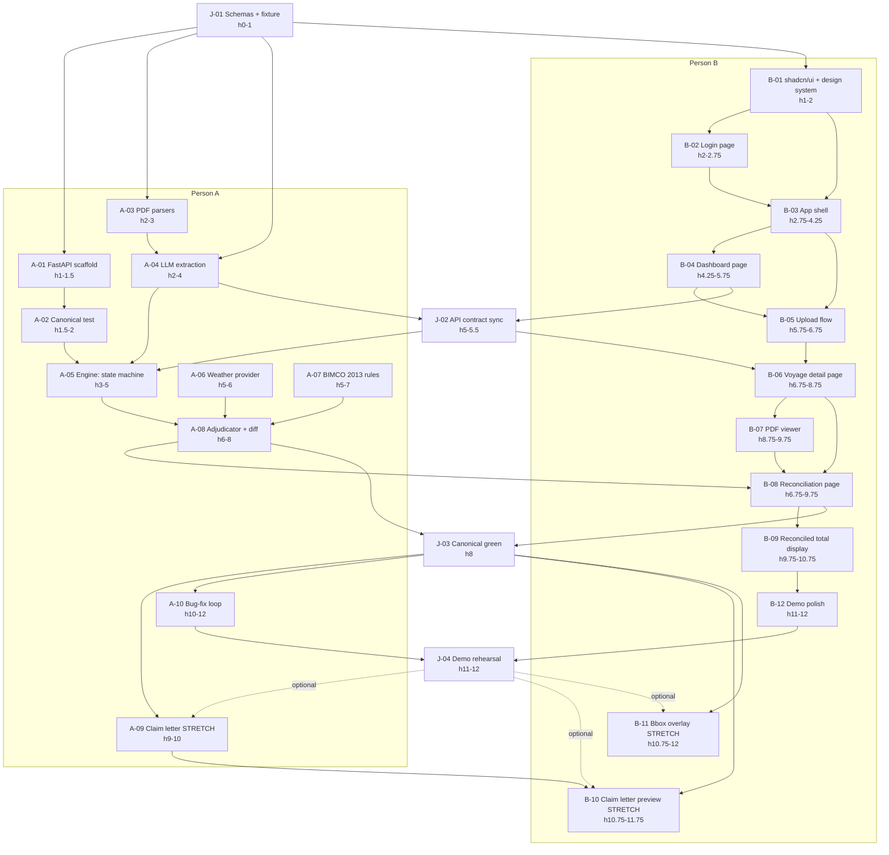

# Keel — Ticket Tracker

> ## ⚠️ SUPERSEDED — 2026-09-30
>
> **This is a historical record of a 12-hour hackathon build, preserved as
> written.** It is not a backlog and not a status report. None of the workstreams
> below were carried out as planned, and the completion marks in
> [tracker.md](tracker.md) are the state at the end of the hackathon, not the
> state of the code today.
>
> **The working roadmap is [../continuation-plan.md](../continuation-plan.md).**
> The code as it actually is is described in [AGENTS.md](../../AGENTS.md) and
> [README.md](../../README.md).
>
> Where this document would actively mislead, the line is annotated in place,
> marked `> **Superseded — 2026-09-30:**`. Everything else — including the
> dependency graph and the timeline — is left exactly as it was, because
> rewriting history to match the code would destroy the reason this file exists.
>
> One note on the ticket titles: **"A-07 BIMCO 2013 rules" is a ticket name, not a
> sourcing claim**, and must not be read as saying BIMCO supplies a weather
> threshold. It does not. The *Laytime Definitions for Charter Parties 2013*
> supply only the measurement basis for an excepted period (definition 16) and set
> no numeric threshold; the threshold and the invocation test come from the
> charterparty, and a weather verdict's `rule_authority` is `custom`
> (`apps/api/keel_api/rules/evaluators.py:3-42`, `:60-65`).

12-hour hackathon build for a 2-person team. Tickets are organized into three streams:

- **Magnus** — backend, engine, rule library (Person A)
- **Ertval** — frontend, demo UX (Person B)
- **Joint** (below) — synchronous checkpoints both people stop for

The single success criterion: **at hour 8, the canonical scenario in [PRD §5](../prd.md) produces `reconciled_total_usd == 112_000` end-to-end through the UI.** Everything else is in service of that.

> **Superseded — 2026-09-30:** the section reference was wrong and is corrected
> above. The canonical scenario is **PRD §5**, *"Canonical demo scenario — the
> north star"* (`docs/prd.md:115`), not §4, which is the terminology glossary.
> The figures themselves are unchanged.

> **Superseded — 2026-09-30:** the criterion was met, and it still holds. The
> canonical path is green today: `uv run pytest -m canonical -q` → **15 passed**
> (`tests/test_canonical.py` and `tests/test_reconciliation_cases.py`), and a
> running API serves owner `$187,000`, charterer `$62,000`, reconciled
> `$112,000`, with owner / owner / charterer on 14 / 15 / 16 June 2026.
>
> What this ticket set does **not** describe, and never did: there is no
> authentication, no multi-tenancy, no account system, no sign-up, and no
> certification of any kind. `apps/web/proxy.ts` is a demo stub that says in its
> own first line that it is not authentication.

---

## Joint tickets

These are the only times both people stop their work and align. Skipping these is the fastest way to ship a broken demo.

### J-01 — Pre-flight: schemas + fixture (hour 0 → 1)

**Owner**: Both, pair-programming.
**Blocks**: every Person A ticket from A-01 onward; every Person B ticket from B-01 onward.

- Write the final Pydantic schemas from [PRD §9](../prd.md) into `apps/api/keel_api/schemas.py`. Both parties must agree these are frozen.
- Generate or hand-tune the canonical voyage_001 fixture (5 PDFs + `weather_port_xyz.json`) so the engine will produce `$187,000 / $62,000 / $112,000` exactly. Synthesize PDFs from Markdown if no real samples are available.
- Commit `fixtures/voyage_001/expected_reconciliation.json` — the ground-truth oracle the canonical assertion test (A-02) checks against.

**Done when**: schemas are committed, all six fixture files exist on disk, the expected reconciliation JSON declares `$112,000` and the three per-day verdicts.

> **Superseded — 2026-09-30:** the schemas are committed and still frozen
> (`apps/api/keel_api/schemas.py`), and `expected_reconciliation.json` is
> committed and still the oracle. **The five PDFs were never committed to this
> sanitised public copy** — `fixtures/voyage_001/` holds eight JSON files and no
> `*.pdf`. That is why 16 parser and extraction tests fail here and are
> quarantined in CI. The demo does not need them: the cached `extracted_*.json`
> files let the graph run with no API key.

---

### J-02 — API contract checkpoint (hour 5 → 5.5)

**Owner**: Both, 30-minute sync.
**Blocked by**: A-04 (LLM extraction), B-04 (dashboard/upload).
**Blocks**: A-05 (calculation engine), B-06 (voyage detail page).

- Person B stops using the mock API and points the frontend at Person A's `/extract` and `/calculate` endpoints.
- Resolve the inevitable schema drift. **Pydantic shapes win** — frontend adapts.
- Confirm both `$187,000` and `$62,000` render in the UI (reconciliation not yet wired).

**Done when**: voyage detail page renders real numbers for both parties from a real backend.

> **Superseded — 2026-09-30:** the contract did not settle the way this ticket
> describes. There are no `/extract` or `/calculate` endpoints; the API exposes
> `/voyages`, `/voyages/{id}`, `/voyages/{id}/status`, `/reconciliations`, and
> `/voyages/{id}/letter`, and the whole reconciliation comes back from one
> `GET /voyages/{id}` (`apps/api/keel_api/main.py`). The wire contract is
> `apps/web/lib/types.ts`, produced by `apps/api/keel_api/adapters.py`, and the
> frontend's mock is off (`USE_MOCK = false`, `lib/api.ts:24`).

---

### J-03 — Canonical assertion green (hour 8)

**Owner**: Person A presents, Person B verifies in UI.
**Blocked by**: A-08, B-08.
**Blocks**: A-09, A-10, B-09, B-10, B-11.

- Run `pytest -k canonical` — must pass.
- Open the reconciliation page in the browser. Must show `$112,000` with three day cards (June 14 = owner, June 15 = owner, June 16 = charterer).
- If this is not green at hour 8, stop adding features. Both people drop into fix-mode.

**Done when**: `$112,000` is rendered in the browser via the real pipeline.

> **Superseded — 2026-09-30:** both commands still work and both are green.
>
> ```console
> $ cd apps/api && uv run pytest -k canonical -q
> 19 passed, 311 deselected in 1.33s
>
> $ cd apps/api && uv run pytest -m canonical -q
> 15 passed, 315 deselected in 1.42s
> ```
>
> `-m canonical` is the gate CI runs. It is a **different, narrower** set than
> `-k canonical`: the marker selects 3 tests in `test_canonical.py` plus 12 in
> `test_reconciliation_cases.py`, while `-k` additionally matches four tests whose
> *names* contain "canonical" (`test_engine.py`, `test_agent_graph.py`).

---

### J-04 — Demo rehearsal (hour 11 → 12)

**Owner**: Both.
**Blocked by**: A-10, B-12.

- Run the [PRD §12 demo script](../prd.md) verbatim, twice, with a stopwatch.
- Identify and fix only the things that break the script. **Stop fixing anything else.**
- Confirm: laptop charged, browser zoom set, tabs pre-opened, fixtures pre-uploaded if needed.

**Done when**: two clean run-throughs under 100 seconds each.

---

## Dependency graph


```mermaid
graph TD
    J01[J-01 Schemas + fixture<br/>h0-1]

    subgraph Person A
        A01[A-01 FastAPI scaffold<br/>h1-1.5]
        A02[A-02 Canonical test<br/>h1.5-2]
        A03[A-03 PDF parsers<br/>h2-3]
        A04[A-04 LLM extraction<br/>h2-4]
        A05[A-05 Engine: state machine<br/>h3-5]
        A06[A-06 Weather provider<br/>h5-6]
        A07[A-07 BIMCO 2013 rules<br/>h5-7]
        A08[A-08 Adjudicator + diff<br/>h6-8]
        A09[A-09 Claim letter STRETCH<br/>h9-10]
        A10[A-10 Bug-fix loop<br/>h10-12]
    end

    subgraph Person B
        B01[B-01 shadcn/ui + design system<br/>h1-2]
        B02[B-02 Login page<br/>h2-2.75]
        B03[B-03 App shell<br/>h2.75-4.25]
        B04[B-04 Dashboard page<br/>h4.25-5.75]
        B05[B-05 Upload flow<br/>h5.75-6.75]
        B06[B-06 Voyage detail page<br/>h6.75-8.75]
        B07[B-07 PDF viewer<br/>h8.75-9.75]
        B08[B-08 Reconciliation page<br/>h6.75-9.75]
        B09[B-09 Reconciled total display<br/>h9.75-10.75]
        B10[B-10 Claim letter preview STRETCH<br/>h10.75-11.75]
        B11[B-11 Bbox overlay STRETCH<br/>h10.75-12]
        B12[B-12 Demo polish<br/>h11-12]
    end

    J02[J-02 API contract sync<br/>h5-5.5]
    J03[J-03 Canonical green<br/>h8]
    J04[J-04 Demo rehearsal<br/>h11-12]

    J01 --> A01
    J01 --> A03
    J01 --> A04
    J01 --> B01

    A01 --> A02
    A02 --> A05
    A03 --> A04
    A04 --> A05
    A05 --> A08
    A06 --> A08
    A07 --> A08

    B01 --> B02
    B01 --> B03
    B02 --> B03
    B03 --> B04
    B03 --> B05
    B04 --> B05

    A04 --> J02
    B04 --> J02
    J02 --> A05
    J02 --> B06

    B05 --> B06
    B06 --> B07
    B06 --> B08
    B07 --> B08
    A08 --> B08

    B08 --> B09
    B08 --> J03
    A08 --> J03

    B09 --> B12
    B12 --> J04
    A10 --> J04

    J03 --> B10
    J03 --> B11
    J03 --> A09
    J03 --> A10
    A09 --> B10

    J04 -.optional.-> A09
    J04 -.optional.-> B10
    J04 -.optional.-> B11
```

---

## Timeline (Gantt-style)

```
Hour:    0    1    2    3    4    5    6    7    8    9   10   11   12
         |----|----|----|----|----|----|----|----|----|----|----|----|
JOINT    [J01]                   [J02]            [J03]            [J04]
PERSON A      [A01][A02][A03 ][A04   ][A05  ][A07  ][A08  ][A09 ][A10  ]
                                     [A06]
PERSON B      [B01     ][B02 ][B03      ][B04 ][B05  ][B06       ][B12 ]
                                                [B08            ]
                                                     [B07 ][B09 ][B10/11*]

* = stretch goals, only if everything else is green
```

---

## Operating rules

1. **No work that isn't tracked here.** If you discover a new task, write a ticket before you start.
2. **The canonical assertion is the only metric.** A passing `$112,000` test beats any other progress.
3. **Stretch goals are stretch.** A-09, B-10, B-11 only after J-03 is green.
4. **Hour-10 hard freeze on new UI work.** From hour 10, frontend is bug-fix only.
5. **Push to `main` every successful ticket.** Visible progress prevents both people drifting.

---

## Stretch goals (only after J-03)

| Ticket | Owner | Why deferred |
|---|---|---|
| A-09 — Claim letter PDF generation | A | Plain HTML preview is enough for the demo |
| B-10 — Claim letter preview | B | Same as above |
| B-11 — Bbox overlay on PDF | B | react-pdf overlays often take 4-6h; cost too high for demo value |
| Reversible laytime in engine | A | Out of v1 engine scope per PRD §10 |
| Real weather API (Open-Meteo) | A | Fixture provider is fully sufficient for v1 |
